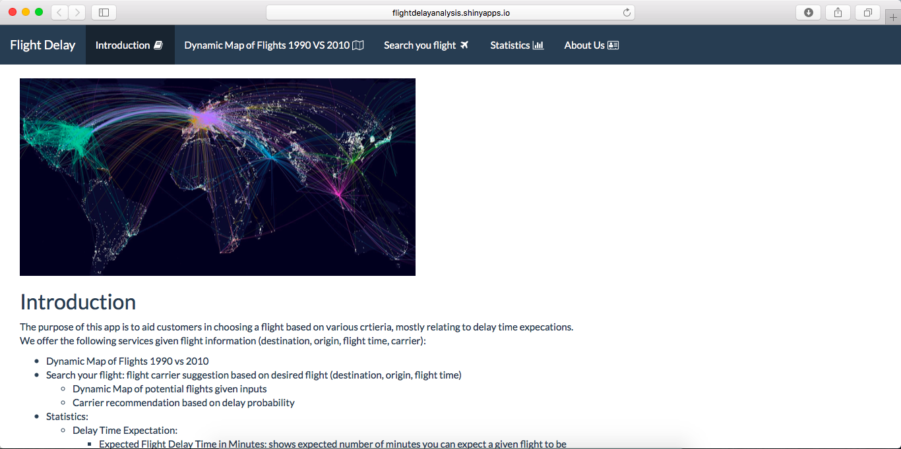

# Project 2: Open Data App - an RShiny app development project

## Flight Delay Analysis
Term: Fall 2017

+ Team 8
+ **Flight Delay Analysis**: 
+ **Team members**:
	+ Shiqi Duan
	+ Christina Huang 
	+ Jingkai Li
	+ Peter Li
	+ Han Lin

The app is available here: https://flightdelayanalysis.shinyapps.io/flightdelayanalysis/

+ **Project summary**: Traveling is very stressful and no one wants their flight to be delayed. The purpose of this project is to help customers minimize their flight delay time. We do this by using the last 3 years of flight data to produce statistics and model outputs to aid in travel decision making. The app allows users to specify a certain flight (destination, origin) and flight time (month). Given these, the model can create plots and analysis on expected delay times, delay time distributions, delay reason distributions, and delay probabilities. The app also suggests the carrier based on whichever has the lowest delay probability. Furthermore, the app also allows users to specify a threshold of minutes they will allow the flight to be delayed to determine their satisfaction probability (i.e. probability the user will arrive within their threshold). Further analysis is also provided on cancellations.

+ **Contribution statement**: All team members contributed equally in all stages of this project. All team members approve our work presented in this GitHub repository including this contributions statement. 

+ **Project Demonstration**:



Following [suggestions](http://nicercode.github.io/blog/2013-04-05-projects/) by [RICH FITZJOHN](http://nicercode.github.io/about/#Team) (@richfitz). This folder is orgarnized as follows.

```
proj/
├── app/
├── lib/
├── data/
├── doc/
└── output/
```

Please see each subfolder for a README file.

