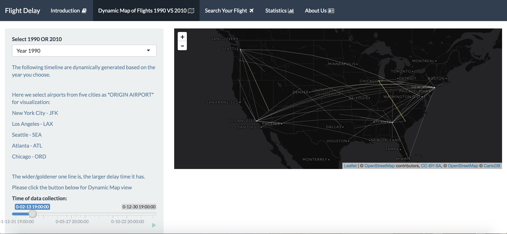
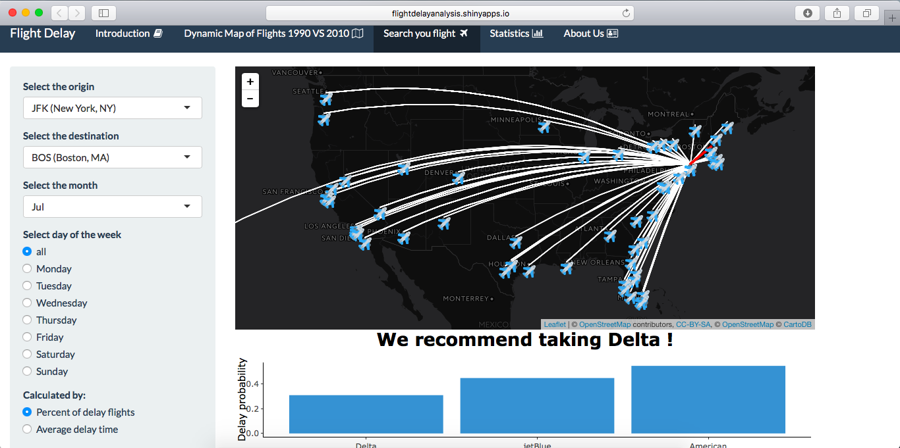
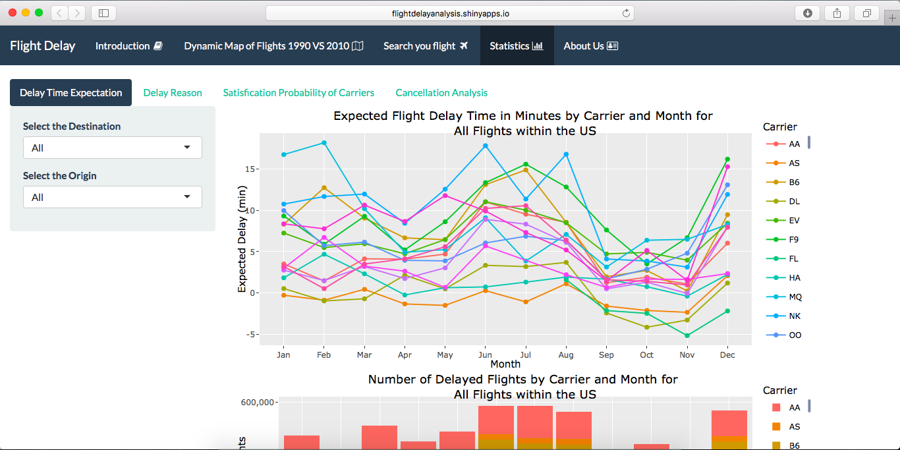
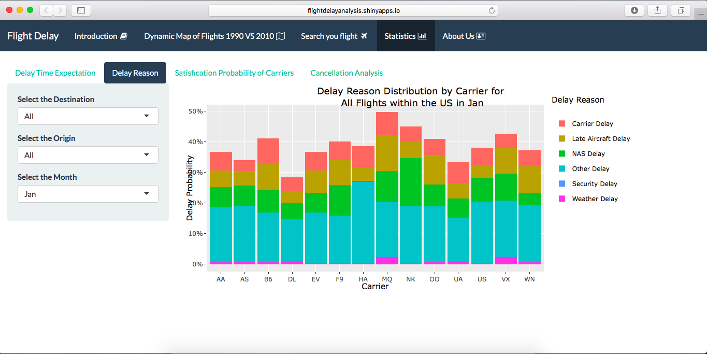
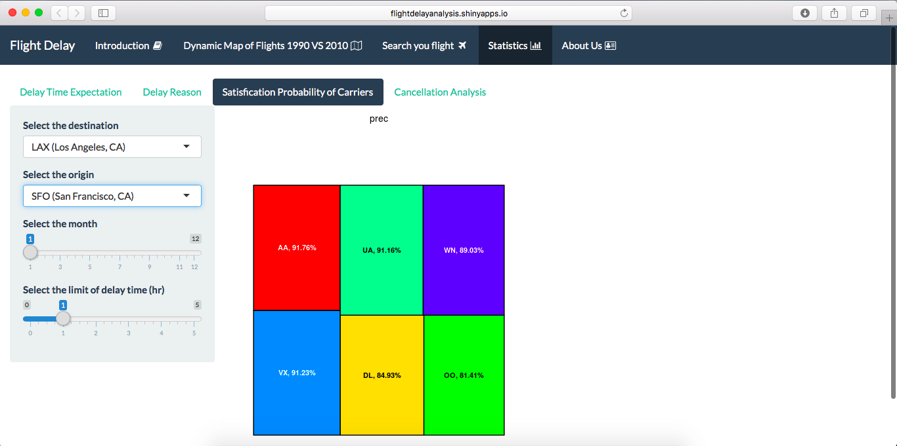
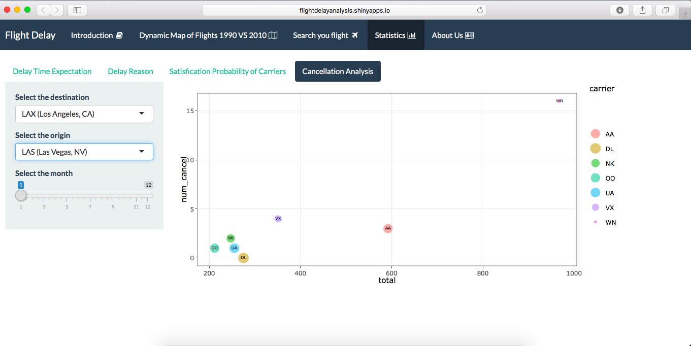

# Project 2: Flight Delay Analysis RShiny App

You are welcomed to visit our APP [here](https://rainofmaster.shinyapps.io/flightAnalysis/). 
We are **Team 8**!

## Team members
- Shiqi Duan
- Christina Huang 
- Jingkai Li
- Peter Li (Presenter)
- Han Lin

## Project summary
Traveling is so stressful and no one wants their flight delayed! So? We established an App that can help customer choose the right carrier and minimize their flight delay time!

### How to recommedate the RIGHT carrier?
We do this by using the last 3 years of flight data to produce statistics and model outputs to aid in travel decision making. The app allows users to specify a certain flight line (destination, origin) and flight time (month). Given these, the model can create plots and analysis on expected delay times, delay time distributions, delay reason distributions, and delay probabilities. **The app suggests the carrier based on whichever has the lowest delay probability.** 

What's more, the app also allows users to specify a **threshold of minutes** they will allow the flight to be delayed to determine their satisfaction probability (i.e. probability the user will arrive within their threshold). Further analysis is also provided on cancellations.


## Contribution statement
All team members contributed equally in all stages of this project. All members discussed the framework, collected and cleaned data from data.gov, and designed the app. Team members wrote codes for ui.R and server.R for their parts, and combined them together and deployed the app. All team members uploaded their work presented in this GitHub repository including this contributions statement. 

**Christina Huang** and **Jingkai Li** mainly focus on the Dynamic map of Flights 1990vs2010. 

**Han Lin** mainly focus on Search Your Flight. 

**Peter Li** mainly focus on Delay Time Expectation, and Delay Reason. 

**Shiqi Duan** mainly focus on Satisfaction Probability of Carriers and Cancellation Analysis.


## Project Demonstration
### Introduction Page


### Dynamic Map of Delay Time (1990 vs 2010)



### Recommendation Flight Carrier



### Statistic Analysis
- Delay Time



- Delay Reason


- Comparison between Carriers


- Cancellation Analysis


## Data Source
+ [data.gov](https://www.transtats.bts.gov/DL_SelectFields.asp?Table_ID=236&DB_Short_Name=On-Time)
+ [openflights.org](https:/openflights.org/data.html)


------------------------------------------------------------------------
Following [suggestions](http://nicercode.github.io/blog/2013-04-05-projects/) by [RICH FITZJOHN](http://nicercode.github.io/about/#Team) (@richfitz). This folder is orgarnized as follows.

```
proj/
├── app/
├── lib/
├── data/
├── doc/
└── output/
```

Please see each subfolder for a README file.

