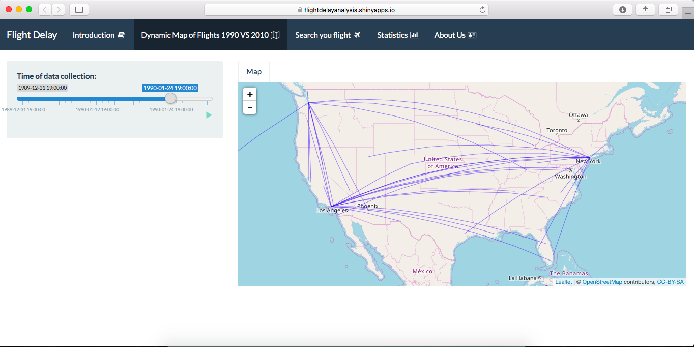

Next meeting : Mon 6PM in school 

Han & Peter -- multi-layer R Shiny

Yuchen & Linhan -- R Shiny Map Part

Shiqi -- Prediction

Han & Pete r& Shiqi -- Story


# Project 2: Open Data App - an RShiny app development project

### [Project Description](doc/project2_desc.md)



In this second project of GU4243/GR5243 Applied Data Science, we develop an *Exploratory Data Analysis and Visualization* shiny app on a topic of your choice using U.S. government open data released on the [data.gov](https://data.gov/) website. See [Project 2 Description](doc/project2_desc.md) for more details.  

The **learning goals** for this project is:

- business intelligence for data science
- data cleaning
- data visualization
- systems development/design life cycle
- shiny app/shiny server

*The above general statement about project 2 can be removed once you are finished with your project. It is optional.

## Project Title Lorem ipsum dolor sit amet
Term: Fall 2017

+ Team 8
+ **Projec title**: + Team members
	+ team member Shiqi Duan
	+ team member Christina Huang 
	+ team member Jingkai Li
	+ team member Peter Li
	+ team member Han Li

+ **Project summary**: 
SD: It is very common to encounter delays when traveling by air. To guarantee the arrival time is not later than the proposed time limit, people can select their carriers according to our treemap plot. We can select the origin and destination airports, the proposed traveling month, and the proposed delay time limit from 0 to 5 hours. Then the Treemap will display the carriers of all the flights satisfying your requirements with the success probability. Here, the success probability is the probability that if you choose certain carrier for your travel from the chosen origin to the chosen destination in the chosen month, then how likely you can arrive at the destination no later than the chosen delay time limit. We believe this app can help you make a smarter choice of carriers.

+ **Contribution statement**: ([default](doc/a_note_on_contributions.md)) All team members contributed equally in all stages of this project. All team members approve our work presented in this GitHub repository including this contributions statement. 

Following [suggestions](http://nicercode.github.io/blog/2013-04-05-projects/) by [RICH FITZJOHN](http://nicercode.github.io/about/#Team) (@richfitz). This folder is orgarnized as follows.

```
proj/
├── app/
├── lib/
├── data/
├── doc/
└── output/
```

Please see each subfolder for a README file.

